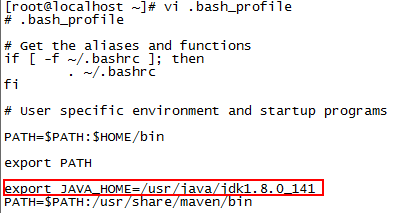
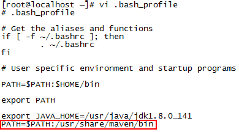

# 1 准备工作
- wget安装: 一个下载工具，`yum install wget`

- git安装: `yum install git`

- jdk安装及配置:
    * Step1: 从官方网站下载你需要的jdk,[jdk下载地址](http://download.oracle.com/otn-pub/java/jdk/8u141-b15/336fa29ff2bb4ef291e347e091f7f4a7/jdk-8u141-linux-x64.rpm?AuthParam=1500866848_2b53dd92b4aa8f5fe7dc45eb42584033)
    * Step2: 安装命令:`yum localinstall jdk-8u141-linux-x64.rpm`,安装目录为：`/usr/java/jdk1.8.0_141`
    * Step3: `设置JAVA_HOME环境变量`
    
        
        
  > 因为yum install命令为我们安装的是openjdk, 而我们需要的是oracle jdk, 因此采用手动安装的方式

- maven安装
    * Step1: 下载maven，[maven下载地址](http://mirrors.tuna.tsinghua.edu.cn/apache/maven/maven-3/3.5.0/binaries/apache-maven-3.5.0-bin.zip)，然后解压到目录`/usr/share/maven`
    * Step2: 设置`PATH`
    
        
    
    * Step3: 修改目录`/usr/share/maven/conf`下的`settings.xml`文件，里面配置aliyun docker镜像服务的账号密码。


# 2 部署

- 克隆或拉取代码

- 打包镜像并推送镜像: 在project所在目录下`/root/source_code/xxx-service`，执行命令`mvn clean package docker:build -DskipTests`

- 删除aliyun服务器上旧版本的容器和镜像，并更新镜像和重启镜像:
    * Step1: 复制文件`feitian_test.pem`到`/root/`目录下。
    
    * Step2: 执行命令`chomd 400 feitian_test.pem`(只需在第一次登录时执行)。
    
    * Step3: 进入aliyun服务器`ssh -i feitian_test.pem root@106.14.188.213`(Step4~7都是在aliyun服务器上执行)。
    
    * Step4: 执行`docker ps`查看当前运行中的容器列表，执行命令`docker stop [CONTAINER ID]`停止正在运行的`xxx-service`容器，接着执行`docker rm [CONTAINER ID]`删除该容器。
   
    * Step5: 执行`docker images`查看镜像列表，执行`docker rmi [IMAGE ID]`删除当前镜像。
    
    * Step6: 进入目录`/root/feitian`，执行`docker-compose up -d --no-recreate`更新为最新镜像并运行。
    
    * Step7: 执行`docker logs [CONTAINER ID]`查看容器日志。
    
    
# 3 在aliyun服务器上完成部署
- 需要修改的文件
    * 将pom文件里的服务器访问地址由外网地址改为内网地址
    ```
    <docker.registry>registry-vpc.cn-shanghai.aliyuncs.com</docker.registry>
    ```
- 其他的和步骤2相同。